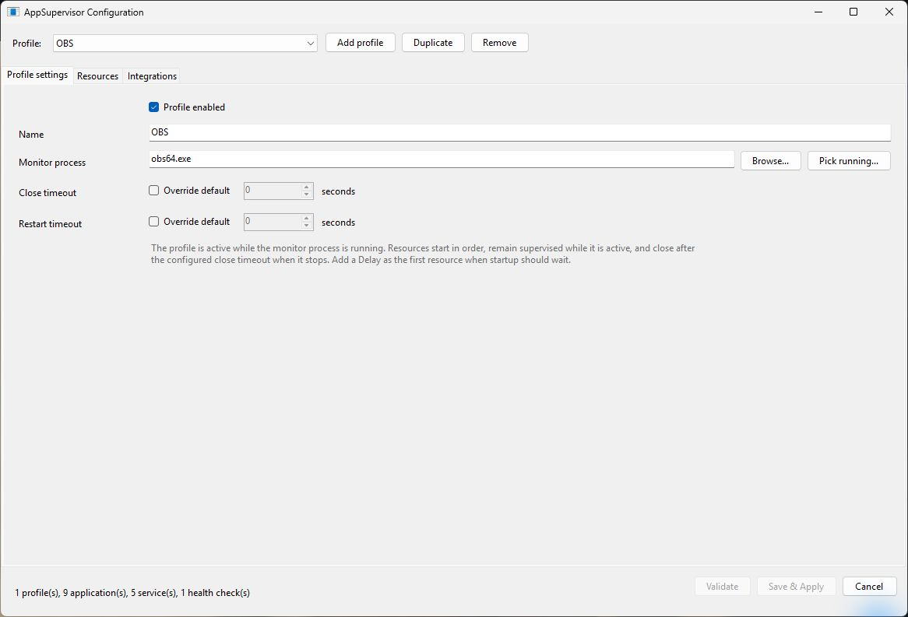
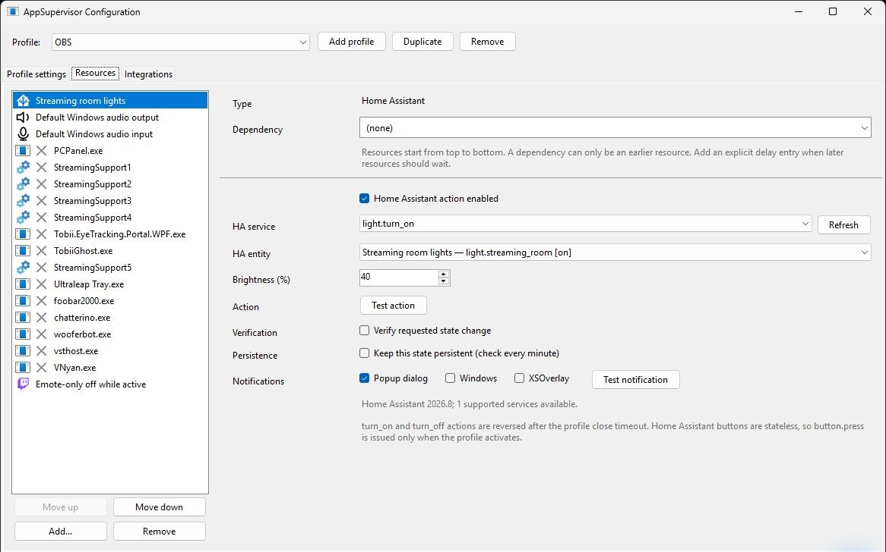
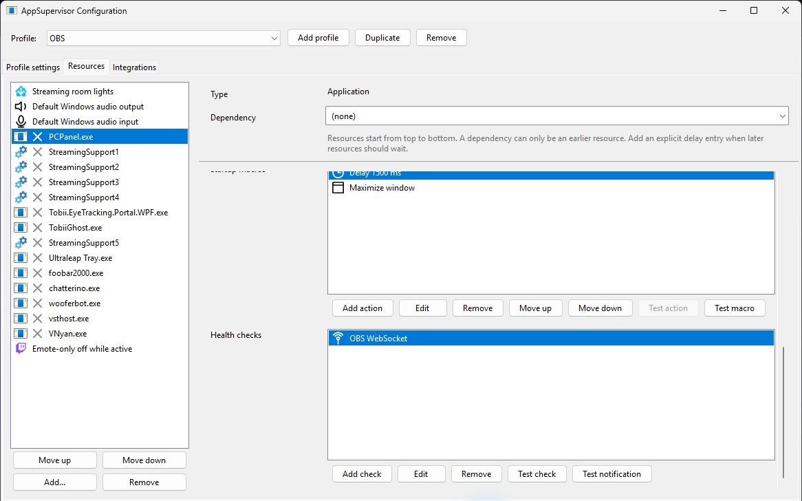
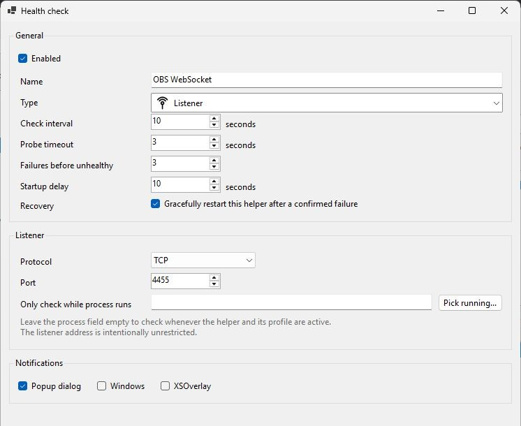
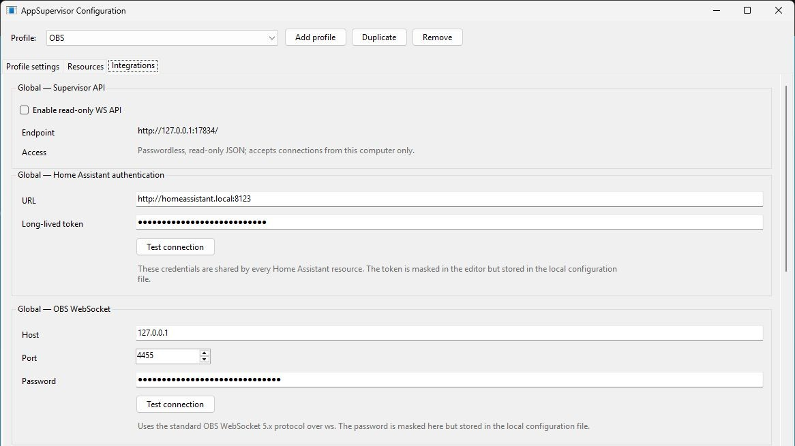
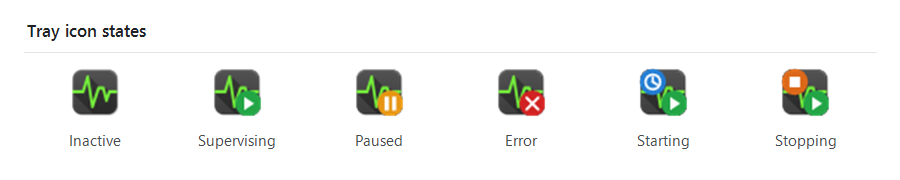

# AppSupervisor

**Keep a complete Windows setup in sync with the application that needs it.**

[](https://github.com/tomaae/AppSupervisor/releases/latest)


[](https://github.com/tomaae/AppSupervisor/actions/workflows/ci.yml)


AppSupervisor is a lightweight Windows tray application that watches for a configured process and then starts, supervises, restarts, and closes the applications, services, devices, and integrations that belong with it.

For example, starting OBS can activate streaming helpers, audio settings, lighting, and Twitch chat modes in one ordered profile. Closing OBS reverses the resources that should be restored and leaves one-shot actions alone.

> [!CAUTION]
> **This project was fully created by AI.** Selected behavior has been tested by the project owner, but the code has not received a comprehensive independent human audit. Review it carefully before use—especially because AppSupervisor runs with administrator privileges and can start or stop applications and Windows services.

## Quick start

1. Download and extract the [latest release](https://github.com/tomaae/AppSupervisor/releases/latest).
2. Install the **.NET 10 Desktop Runtime** if it is not already installed.
3. Run `AppSupervisor.exe`, approve the UAC prompt, and find AppSupervisor in the notification area.
4. Double-click the tray icon—or right-click it and choose **Configure...**—to open the editor.
5. Create a profile, choose the process that activates it, add helpers in startup order, then choose **Validate** and **Save & Apply**.

AppSupervisor runs in the notification area rather than opening a permanent main window. Its configuration is stored beside the executable in `config.json`.

## How profiles work

| Event | What AppSupervisor does |
| --- | --- |
| The monitored process starts | Activates the profile and processes enabled resources from top to bottom. |
| A helper or service becomes unavailable unexpectedly | Reports the problem and optionally restarts it after the configured timeout. |
| A health check confirms a failure | Notifies the configured destinations and can gracefully restart the affected helper. |
| The monitored process remains closed | Waits for the profile's close timeout, then closes, stops, or restores reversible resources. |
| Supervision is paused or AppSupervisor exits | Leaves external applications, services, devices, and integration state untouched. |

## Configuration tour

The screenshots below use a sanitized copy of a real OBS profile. They contain example credentials and device data only.

### 1. Choose what activates a profile

A profile watches one executable name. The optional close and restart timeout overrides apply to everything owned by that profile.



### 2. Build an ordered helper list

Add applications, Windows services, delays, audio interfaces, Home Assistant actions, OBS actions, or Twitch actions. Drag or move helpers into startup order, and make a helper depend on an earlier application or service when readiness matters.

The left side keeps the entire sequence visible; the right side shows the settings and test actions for the selected helper.



### 3. Automate startup and verify helper health

Each helper can run an ordered Startup macro after launch and can own independent health checks. Individual actions, full macros, checks, notifications, and the complete helper lifecycle can be tested before the profile is activated.



A health check controls its own timing, failure threshold, recovery behavior, process gate, and notification destinations:



### 4. Configure shared integrations once

Home Assistant, OBS WebSocket, Twitch, SteamVR monitoring, diagnostic logging, and the read-only local API are global settings shared by profiles. Credentials remain masked in the editor but Home Assistant and OBS credentials are stored in the local configuration file.



### 5. Read supervision state from the tray

The tray icon stays compact while showing the important state. The blue clock means helpers are still starting. The orange stop badge appears both during the profile's close timeout and while helpers are closing; either badge can be combined with the green supervising or red error badge when both conditions apply.



- **Inactive:** no profile currently needs resources.
- **Supervising:** at least one profile is active.
- **Paused:** supervision is paused; external resources are left untouched.
- **Error:** one or more active supervision errors need attention.
- **Starting:** one or more profile resources are still starting.
- **Stopping:** the close timeout is running or one or more profile resources are still closing.

## Contents

- [Functionality summary](#functionality-summary)
- [Profiles and resources](#profiles-and-resources)
- [Helper applications](#helper-applications)
- [Startup macros](#startup-macros)
- [Windows services](#windows-services)
- [Health checks](#health-checks)
- [Home Assistant](#home-assistant)
- [OBS WebSocket](#obs-websocket)
- [Windows audio interfaces](#windows-audio-interfaces)
- [SteamVR device monitoring](#steamvr-device-monitoring)
- [Twitch](#twitch)
- [Notifications](#notifications)
- [Configuration editor](#configuration-editor)
- [Diagnostic logging](#diagnostic-logging)
- [Supervisor API](#supervisor-api)
- [Installation and building](#running-a-packaged-build)

## Functionality summary

- Activates profiles when their monitored process starts, then processes applications, services, delays, Windows audio interfaces, Home Assistant, OBS, and Twitch actions in the configured order.
- Restarts applications or services that stop unexpectedly, with configurable close and restart timeouts.
- Gracefully closes applications by default, with optional force-kill only when explicitly enabled.
- Supports regular executables, Steam applications, Microsoft Store/MSIX applications, and Windows services.
- Launches every helper with the helper executable's directory as its working directory so relative files resolve consistently.
- Recognizes Launch4j helpers with a bundled Java runtime, launching their wrapper and supervising the persistent `javaw.exe` process.
- Runs ordered per-application Startup macros on profile activation after confirming the helper is available, including delays, hotkeys, and window placement actions.
- Can test a selected helper through its normal launch, Startup macro, and close lifecycle without activating its profile.
- Provides per-application listener and VRChat OSCQuery health checks, including optional recovery after a confirmed failure.
- Monitors expected SteamVR controllers, trackers, and base stations without starting or controlling SteamVR.
- Runs Twitch broadcaster chat messages, ads, and reversible chat-mode changes when a profile activates.
- Sends per-resource alerts through popup dialogs, Windows notifications, or XSOverlay.
- Suppresses repeated copies of the same active supervision error and exposes concrete active-error details in the tray tooltip.
- Includes a graphical configuration editor with searchable, loading-aware pickers and recognizable resource-list icons.
- Validates configuration before applying it and keeps the last valid configuration active if a reload fails.
- Writes configurable per-session diagnostic logs beside the executable and configuration.
- Can register itself to start elevated when the user signs in to Windows.
- Can expose cached supervision status through an optional passwordless, read-only local HTTP API.

## Detailed functionality

### Profiles and resources

Each profile watches one process. When that process appears, AppSupervisor activates the profile's enabled resources from top to bottom. When it remains absent for the configured **Close timeout**, AppSupervisor closes or stops those resources.

Resources can include:

- Helper applications.
- Windows services.
- Nonblocking delays between startup entries.
- Home Assistant actions.
- OBS actions.
- Twitch broadcaster actions.
- Windows audio interface actions.

A resource may depend on one earlier application or service being ready. Profiles operate independently, so a delay or slow resource in one profile does not hold up another. Pausing or exiting AppSupervisor leaves external applications and services untouched.

The monitor process only controls whether its profile is active; its start or stop does not produce a notification. Notification destinations configured on a helper apply only to that helper, and destinations configured on a health check apply only to that check. AppSupervisor-level configuration and startup messages use their own popup channel instead of borrowing destinations from profile resources.

### Helper applications

Applications can be launched directly from an executable, through Steam, or through a Microsoft Store/MSIX app entry. Direct launches may include command-line arguments.

AppSupervisor identifies helpers by executable path. For a conservatively detected Launch4j wrapper with an adjacent `jre\bin\javaw.exe`, it launches the configured wrapper and arguments but identifies and controls the helper through that persistent bundled runtime. If multiple independent instances are found, it closes them before starting one fresh instance. Closing is graceful unless **Allow force-kill after all graceful close attempts fail** is enabled.

Per-application options include:

- Restarting after an unexpected exit.
- Keeping the application closed until an active profile needs it.
- Minimizing its windows after launch.
- Detecting unresponsive windows and restarting after repeated failures.
- Choosing notification destinations.

The editor's **Test helper** button exercises the selected helper through the same production lifecycle without activating its profile. It uses the configured direct, Steam, or Store launch mechanism and direct-launch arguments, waits for startup confirmation, runs the complete Startup macro, and becomes **Stop test** only after startup work finishes. Stopping uses the normal graceful close, retry, tray-exit, and optional force-kill behavior without waiting for the profile close timeout. The test is unavailable while the selected profile is active or still completing shutdown. Closing the editor or AppSupervisor while a test is active first attempts to close the test helper.

### Startup macros

Each helper application can have an ordered **Startup macros** sequence. AppSupervisor runs the sequence whenever a profile activates the helper: immediately when one existing helper instance is confirmed, or after a requested launch or relaunch is confirmed.

Available actions are:

- A nonblocking delay.
- A captured multi-key hotkey.
- Moving a window to coordinates relative to a selected monitor's working area.
- Resizing a window.
- Minimizing, maximizing, or restoring a window.
- Bringing a window to the front without explicitly activating it.

The editor displays detected monitor hardware names and stable Windows display identifiers. Move and resize actions can read the running helper window's current position or size, and every non-delay action can be tested individually. The complete sequence can also be tested before saving.

Hotkeys use Windows `SendInput`, so they are injected system-wide rather than sent to one window. AppSupervisor does not explicitly activate the helper, but the active application may also observe the shortcut and the helper's resulting command may change focus.

Window actions require exactly one eligible visible top-level helper window. Transient process or window unavailability is retried non-blockingly for as long as the helper remains supervised, so CPU load and slow application startup cannot consume a wall-clock readiness deadline. Move and Resize also remain pending until the requested bounds are observed unchanged across repeated lifecycle passes for at least two seconds; if the application rearranges its loading window, AppSupervisor reapplies the requested geometry and restarts that stability check. Invalid or ambiguous window targets still produce a helper error through the configured notification destinations. Safe later actions continue, and a macro failure does not itself restart the helper.

The existing **Minimize windows after starting** option remains the simpler persistent minimization behavior. When a Startup macro contains a Minimize action, that option is disabled and ignored to prevent the two mechanisms from competing.

### Windows services

The editor lists installed third-party services by service name and warns when an Automatic service is selected because applying an enabled entry changes it to Manual startup. AppSupervisor starts configured services with their profile, optionally restarts them after an unexpected stop, and requests a normal stop when the profile closes.

### Health checks

Health checks belong to a helper application and have their own timing, failure threshold, recovery action, and notification settings.

- **Listener** verifies that the helper owns a configured TCP or UDP port. It can run only while another selected process is active.
- **VRChat OSCQuery** checks VRChat OSCQuery availability and selected avatar parameters. It can also report when most available parameters remain unchanged for too long.

Automatic VRChat OSCQuery checks begin only after `VRChat.exe` has run continuously for three minutes, preventing startup discovery from being treated as a health failure. While VRChat is running, **Pick...** can immediately discover the current avatar's available parameter leaf names without waiting for that automatic-check gate. Applying picker choices preserves configured names that the current avatar does not expose.

A confirmed failure can optionally trigger a graceful restart of the helper. One-shot tests do not change live failure state or restart external processes.

### Home Assistant

Profiles can run `turn_on`, `turn_off`, and `button.press` actions against compatible entities. `light.turn_on` actions also set a brightness from 1% through 100%; verification and persistence check that percentage as well as the `on` state. Stateful actions can be verified after execution and kept persistent while the profile is active. When the profile closes, `turn_on` and `turn_off` actions are reversed; buttons run only during activation.

Home Assistant uses a shared URL and long-lived access token. The token is stored in the local configuration files, so those files must be treated as credentials.

### OBS WebSocket

Profiles can switch the OBS program scene, mute or unmute an OBS input, and show or hide a source in a scene. OBS actions are ordinary ordered resources, so a profile may monitor `obs64.exe` and run them after OBS starts. Each action runs once during profile activation; closing the monitored app never restores or toggles the resulting OBS state.

OBS uses the standard WebSocket 5.x protocol over `ws` with a shared host, port, and optional password. The password is stored in the local configuration files, so those files must be treated as credentials.

### Windows audio interfaces

Profiles can set the master volume and mute state of an active Windows playback or recording interface. The interface picker includes **Default output** and **Default input** choices that follow the current Windows multimedia defaults. Before applying the requested state, AppSupervisor captures the current volume and mute values. By default it restores both values when the monitored app closes; clear **Restore original volume and mute when monitored app closes** when the requested state should remain in place. **Test for 5 seconds** temporarily applies the configured state and always attempts to restore the original values.

Windows can replace an audio endpoint ID after a driver update, reconnect, or device re-enumeration. AppSupervisor therefore stores the endpoint's device-instance ID, physical container ID, direction, and friendly names as recovery signals. It prefers exact and stable identity matches, and accepts a name-only fallback only when exactly one active interface matches; ambiguous matches require selecting the interface again in the editor.

### SteamVR device monitoring

AppSupervisor can monitor configured controllers, trackers, and Lighthouse/base-station devices while SteamVR is already running. Discovery records controller handedness and SteamVR tracker assignments such as left foot, left knee, or waist, so offline and recovery notifications identify the missing role. It does not start or restart SteamVR and does not control devices.

After repeated connection failures, it sends the selected notifications and shows an offline-device window. Alerts for a device can be silenced for the rest of the current SteamVR session, including any later disconnections after a recovery; recovery is still detected automatically. The window closes once every device shown in it has been silenced.

Generic/FBT trackers are monitored only after SteamVR reports them connected at least once in the current SteamVR session. A tracker intentionally left powered off for the whole session therefore does not produce an offline alert. Hand controllers and tracking references such as base stations remain mandatory from session startup.

### Twitch

Profiles can send a chat message, run a 30–180 second advertisement, or temporarily change emote-only, followers-only, slow, and subscribers-only chat modes. Messages and ads run once when the profile activates. Chat modes capture their previous Twitch values and restore those exact values after the monitored process closes.

Twitch uses one global broadcaster connection and allows Twitch resources in only one enabled profile at a time. Authorization uses Twitch's public-client device flow: the broadcaster approves access in a browser once, AppSupervisor validates the session hourly and automatically rotates expiring tokens even when no Twitch action runs, and the replacement credentials are stored in Windows Credential Manager for the current user. AppSupervisor includes its public Twitch application identity; users do not configure a Client ID or client secret. Twitch can still require authorization again if the broadcaster revokes access, changes the account password, or AppSupervisor does not run for more than Twitch's 30-day public-client refresh-token inactivity limit. When renewed consent is required, startup maintenance shows a reconnect window before a Twitch profile action is attempted; **Reconnect Twitch** immediately opens browser authorization and completes the connection in that window without routing through the configuration editor.

### Notifications

Helper applications, Windows services, health checks, Windows audio interfaces, Home Assistant actions, OBS actions, Twitch actions, and SteamVR devices can report through:

- Popup dialogs.
- Windows notifications.
- XSOverlay notifications.

If XSOverlay is unavailable, its notifications fall back to Windows notifications.

An identical ordinary supervision error from the same resource is published only once while that error remains active. A distinct error can still notify once, and recovery clears the suppression so a later incident can notify again. The red-X tray tooltip identifies a concrete active error, includes a count when more errors are active, and retains any simultaneous helper startup or shutdown activity that fits within the Windows tooltip limit.

### Configuration editor

Open the editor from **Configure...** in the tray menu or by double-clicking the tray icon. It supports adding, duplicating, removing, enabling, reordering, and configuring profiles and resources.

The editor provides pickers for running processes, executables, Steam applications, Microsoft Store applications, Windows services, Windows playback and recording interfaces, SteamVR devices, and live VRChat OSCQuery parameter names. Running, Steam, and Store application pickers show a loading overlay that prevents selecting incomplete results and provide text filtering after results are ready. The running-process picker excludes Windows service processes and hides Microsoft/Windows applications by default; the Store picker similarly hides Microsoft/system applications unless requested. The running and Store picker status text reports visible and filtered counts.

Steam and Microsoft Store catalog discovery retries transient failures up to four total attempts before reporting a distinct **Application discovery error**. If discovery fails while applying a reload, the previous valid configuration and its supervision remain active. The unified resource list uses each helper executable's icon when available and dedicated type pictograms for services, delays, Windows audio, Home Assistant, OBS, and Twitch resources.

Connections such as Home Assistant, OBS WebSocket, and Twitch, plus SteamVR monitoring, are configured globally rather than inside a profile.

**Validate** checks the complete configuration without saving. **Save & Apply** validates and writes it, then replaces the running configuration. If the new configuration cannot be applied, the previous valid configuration remains active.

### Diagnostic logging

Each AppSupervisor run creates a uniquely named `AppSupervisor_yyMMdd-HHmmss.log` session log beside `AppSupervisor.exe` and `config.json`. Records use local ISO 8601 timestamps with the UTC offset and stable `TRACE`, `INFO`, `WARN`, and `ERROR` labels. Multiline content is indented, and ordinary prose is wrapped for readable viewing without splitting quoted paths or long unbroken values.

Choose the minimum **Log level** under **Integrations → Global — Diagnostic logging**. `Info` is the default, `Trace` includes detailed execution flow, and `Warning` or `Error` reduce routine output. On the first write in a session, AppSupervisor removes current-format and legacy `AppSupervisor.log` files older than five days. Logging is best-effort and never interrupts supervision or shutdown.

### Supervisor API

Enable **Enable read-only WS API** under **Integrations**, then choose **Save & Apply**. AppSupervisor serves HTTP JSON at:

```text
http://127.0.0.1:17834/
```

The listener accepts connections only from the same computer. It has no password, allows cross-origin reads, disables response caching, and accepts only `GET`; unsupported methods return HTTP `405`. It never performs work on behalf of a request. Responses serialize the last immutable snapshot published by the existing one-second supervision timer, so requesting API data does not inspect processes, services, listeners, windows, health probes, or integrations.

#### Internal IDs

Routes use stable internal IDs rather than visible names:

- Profiles use `profileId`.
- Helpers use their existing `resourceId`.
- API responses expose both values as `internalId` and include ready-to-use relative `endpoint` fields.

New IDs are compact hexadecimal strings, so spaces and visible names never appear in API URLs. Existing profiles that predate `profileId` receive one when the configuration is loaded and saved. Duplicating a profile generates a new ID.

An abbreviated configuration therefore looks like:

```json
{
  "profiles": [
    {
      "profileId": "518b32a93ca941a6a65aaf3dde50668d",
      "name": "VR profile",
      "applications": [
        {
          "resourceId": "3fd8f94e25614cb181f09648aaad4e38",
          "path": "C:\\Tools\\helper.exe"
        }
      ]
    }
  ]
}
```

#### Endpoints

| Method and path | Response |
| --- | --- |
| `GET /` | All profiles with `name`, `internalId`, `enabled`, cached `status`, and `endpoint`. |
| `GET /<profileId>` | One profile and all its helpers, including active/enabled state, configured health-check and macro counts, and helper endpoints. |
| `GET /<profileId>/<resourceId>` | Helper identity, cached activity, lifecycle settings, configuration counts, and links to its health-check and macro endpoints. |
| `GET /<profileId>/<resourceId>/healthcheck` | Every configured health check, including application-responsiveness monitoring, timing, recovery settings, and cached status/detail. |
| `GET /<profileId>/<resourceId>/macro` | Whether a Startup macro is configured, its cached execution status, and its ordered actions. |

Unknown profiles, helpers, or child endpoints return HTTP `404`. A helper executable filename may also be accepted in place of `resourceId` when it is unique within the profile, but clients should always use the returned `internalId`; ambiguous filenames return HTTP `409`.

`updatedUtc` identifies when the one-second timer published the returned snapshot. A helper's `active` value means the profile startup sequence has activated that resource; it is not a fresh process query.

Status values are:

- Profile: `disabled`, `paused`, `active`, or `inactive`.
- Helper: `disabled`, `active`, or `inactive`.
- Health check: `disabled`, `inactive`, `checking`, `healthy`, or `unhealthy`.
- Startup macro: `notConfigured`, `idle`, `running`, or `failed`.

#### Example responses

`GET /`:

```json
{
  "updatedUtc": "2026-08-17T12:00:00Z",
  "paused": false,
  "profiles": [
    {
      "name": "VR profile",
      "internalId": "518b32a93ca941a6a65aaf3dde50668d",
      "enabled": true,
      "status": "active",
      "endpoint": "/518b32a93ca941a6a65aaf3dde50668d"
    }
  ]
}
```

`GET /518b32a93ca941a6a65aaf3dde50668d`:

```json
{
  "updatedUtc": "2026-08-17T12:00:00Z",
  "name": "VR profile",
  "internalId": "518b32a93ca941a6a65aaf3dde50668d",
  "enabled": true,
  "status": "active",
  "monitorProcess": "VRChat.exe",
  "helpers": [
    {
      "name": "helper.exe",
      "internalId": "3fd8f94e25614cb181f09648aaad4e38",
      "enabled": true,
      "active": true,
      "status": "active",
      "healthChecksConfigured": 1,
      "macroActionsConfigured": 2,
      "endpoint": "/518b32a93ca941a6a65aaf3dde50668d/3fd8f94e25614cb181f09648aaad4e38"
    }
  ]
}
```

The helper endpoint contains `healthCheckEndpoint` and `macroEndpoint`. Follow those links instead of constructing child paths manually.

#### Windows `curl.exe` smoke test

The following PowerShell script discovers internal IDs and requests every endpoint for the first configured helper:

```powershell
$ErrorActionPreference = 'Stop'
$baseUrl = 'http://127.0.0.1:17834'

function Get-CurlJson([string]$url) {
    $body = & curl.exe --silent --show-error --fail-with-body $url
    if ($LASTEXITCODE -ne 0) {
        throw "curl failed for $url"
    }
    $body | ConvertFrom-Json
}

$root = Get-CurlJson "$baseUrl/"
$profile = $root.profiles | Select-Object -First 1
if ($null -eq $profile) { throw 'No profiles returned.' }

$profileState = Get-CurlJson "$baseUrl/$($profile.internalId)"
$helper = $profileState.helpers | Select-Object -First 1
if ($null -eq $helper) { throw 'The selected profile has no helpers.' }

$helperUrl = "$baseUrl/$($profile.internalId)/$($helper.internalId)"
Get-CurlJson $helperUrl | ConvertTo-Json -Depth 20
Get-CurlJson "$helperUrl/healthcheck" | ConvertTo-Json -Depth 20
Get-CurlJson "$helperUrl/macro" | ConvertTo-Json -Depth 20
```

Error behavior can be checked directly:

```powershell
# 404: unknown profile
curl.exe -sS -o NUL -w '%{http_code}\n' http://127.0.0.1:17834/not-a-profile

# 405: the API is read-only
curl.exe -sS -o NUL -w '%{http_code}\n' -X POST http://127.0.0.1:17834/
```

### Administrator and startup behavior

AppSupervisor requires administrator privileges to manage configured services consistently. It prevents multiple supervisor instances and can create a current-user scheduled task that launches it with elevated privileges at sign-in.

## Configuration storage

Configuration is stored in `config.json` beside `AppSupervisor.exe`. If the file is missing, AppSupervisor creates an empty valid configuration. The last verified configuration is also saved as `config.json.old` during normal shutdown.

Both files are excluded from Git and omitted from release packages. Do not share or commit them if they contain a Home Assistant access token or OBS WebSocket password. Twitch OAuth credentials are not written to these files; Windows Credential Manager stores them separately for the current Windows user.

## Running a packaged build

The release package is Windows x64 and framework-dependent. Install the **.NET 10 Desktop Runtime**, keep all packaged files together, then run `AppSupervisor.exe` and approve the UAC prompt. AppSupervisor runs in the notification area rather than opening a main window.

The package contains:

```text
AppSupervisor.exe
AppSupervisor.NotificationHost.exe
LICENSE
THIRD-PARTY-NOTICES.txt
```

## Building from source

### Requirements

- Windows on x64 hardware.
- .NET 10 SDK.
- PowerShell for the packaging script.
- Administrator access for runtime integration testing involving services.

### Restore, test, and build

From the repository root:

```powershell
dotnet restore .\AppSupervisor.slnx --runtime win-x64
dotnet test .\AppSupervisor.slnx --configuration Release --no-restore
dotnet build .\AppSupervisor.slnx --configuration Release --no-restore
```

### Create a release package

```powershell
.\Publish.ps1
```

The script restores the solution, runs the Release tests, publishes the Windows x64 executables, audits the output, and creates:

```text
artifacts/AppSupervisor/
artifacts/AppSupervisor-win-x64.zip
```

## License

Copyright 2026 Tomaae.

Licensed under the [Apache License 2.0](LICENSE).
