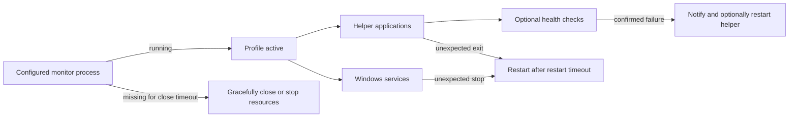

# AppSupervisor

AppSupervisor is a lightweight, Windows-only tray application that starts, supervises, restarts, and gracefully closes groups of helper applications and Windows services according to whether a configured monitor process is running.

> [!CAUTION]
> **This project was fully created by AI.** Its architecture, source code, tests, configuration UI, documentation, and build tooling were generated by AI from human requirements. Selected behavior has been tested by the project owner, but the code has not received a comprehensive independent human audit. Review it carefully before use—especially because AppSupervisor runs with administrator privileges and can start or stop applications and Windows services.

## Functionality summary

- Runs from the Windows notification area with normal, paused, and error tray states.
- Organizes related helper applications and services into process-triggered profiles.
- Starts profile resources when the monitored process appears and closes them after it disappears.
- Restarts unexpectedly stopped helpers and services after a configurable timeout.
- Manages ordinary executables, Steam applications, and Microsoft Store/MSIX applications.
- Normalizes multiple instances of a helper by closing every instance before starting one fresh instance.
- Uses graceful application close attempts by default; force-kill is available only when explicitly enabled.
- Supervises Windows services and enforces Manual startup mode during initialization.
- Supports listener ownership checks and VRChat OSCQuery health checks.
- Routes per-resource notifications to popup dialogs, Windows notifications, and XSOverlay.
- Includes a structured configuration editor with installed-process, Steam, Store, and service pickers.
- Validates configuration strictly and retains the last valid runtime configuration if a reload fails.
- Saves the last verified configuration as `config.json.old` during normal shutdown.
- Can register itself to start elevated at Windows sign-in.

## How supervision works



Each profile watches one process name. When that process is present, AppSupervisor activates every enabled helper application and service in the profile. While the profile remains active, missing resources can be restarted and application health checks continue to run.

When the monitored process disappears, pending recovery stops immediately. After the configured **Close timeout**, helper applications receive graceful close requests and services receive stop requests. Pausing or exiting AppSupervisor leaves external applications and services untouched.

## Detailed functionality

### Helper applications

Helper processes are identified by their full executable path rather than only by filename. This prevents unrelated processes with the same name from being treated as the configured helper.

AppSupervisor can launch a helper in three ways:

- Directly through **Executable**, with optional **Arguments**.
- From the Steam library with **Pick Steam...**.
- From installed Microsoft Store applications with **Pick Store...**.

The Steam and Microsoft Store pickers list installed applications and fill the required launch information automatically. Store selections remain usable when a package update changes its versioned installation path.

If more than one matching helper instance is running, AppSupervisor closes every instance before starting one replacement. If graceful close attempts fail, it reports an error and leaves the process running unless **Allow force-kill after all graceful close attempts fail** is selected.

Launch failures, missing paths, close failures, and minimization failures are contained and reported without terminating AppSupervisor. Pending minimize work is cancelled when the helper or profile becomes inactive, supervision is paused, or the runtime configuration is replaced.

### Windows services

Services are selected by internal service name. The configuration editor loads installed third-party services and filters ordinary Microsoft/Windows services from the default list.

At initialization, AppSupervisor verifies the required service permissions and changes the startup type to **Manual** when necessary. While the profile is active, it starts or continues the service and can recover an unexpected stop after **Restart timeout**. When the profile closes, it requests a normal service stop and reports a timeout instead of forcefully terminating the service process.

### Health checks

Health checks belong to an individual helper application and have independent notification targets.

#### Listener

A listener check verifies that its TCP or UDP port is owned by the helper. The listener address is unrestricted. **Only check while process runs** can optionally pause the check until another selected process is running.

#### VRCOSC

A **VRChat OSCQuery** check runs only while `VRChat.exe` is active and discovers the connection automatically. It can:

- Verify that VRChat's OSCQuery service and root address structure are available.
- Query the configured **Parameter leaf names**.
- Use **Freshness** to report when a strict majority of available parameters remain unchanged.

Failed probes count only after **Startup delay**. **Failures before unhealthy** controls when failure is confirmed, and the first successful probe recovers the check. **Gracefully restart this helper after a confirmed failure** closes all helper instances and starts one replacement.

### Notifications

Each helper application, service, and health check has its own **Notifications** selection:

- **Popup dialog** — a classic Windows modal dialog with an OK button.
- **Windows** — a Windows notification.
- **XSOverlay** — an XSOverlay notification.

If XSOverlay is selected but is not running or cannot accept the message, delivery falls back to a Windows notification. Restart notifications use warning severity; failed restart, launch, close, service, and health operations use error severity where applicable.

Popup notification modals run away from the supervision thread so they cannot block monitoring. Selecting **Exit** closes configuration windows, startup prompts, and outstanding popup notification modals before AppSupervisor terminates.

### Configuration editor

Open the editor with **Configure...** in the tray menu or by double-clicking the tray icon. Only one configuration window can be open at a time.

The **Profile** selector at the top chooses the profile being edited. **Add profile**, **Duplicate**, and **Remove** manage complete profiles, including their applications, services, health checks, and notification selections. The main editor is divided into three tabs.

#### Profile settings tab

- **Profile enabled** temporarily excludes the complete profile without deleting it.
- **Name** identifies the profile in the editor, tray messages, and notifications.
- **Monitor process** determines when the profile is active. **Browse...** selects an executable from disk; **Pick running...** selects from deduplicated running applications with ordinary Microsoft/system processes hidden by default.
- **Close timeout** controls how long the monitor may remain absent before helpers and services are closed. Clear **Override default** to use the built-in value.
- **Restart timeout** controls how long an unexpectedly missing helper or stopped service may remain unavailable before restart. It can also use the built-in default.

#### Applications tab

The left side lists helper applications in the selected profile and provides **Add** and **Remove** commands. Selecting a helper opens its settings on the right:

- **Helper enabled** excludes the helper without deleting it.
- **Executable** is the real process AppSupervisor monitors, closes, and health-checks. It can be entered with **Browse...** or selected from deduplicated running applications with **Pick running...**.
- **App URI** is empty for a normal executable launch. **Pick Steam...** lists installed Steam items and executable candidates, while **Pick Store...** lists launchable Microsoft Store/MSIX applications. These pickers fill both the executable and App URI automatically.
- **Arguments** are available only for direct executable launches.
- **Restart after unexpected exit** enables ordinary process recovery while the profile remains active.
- **Minimize windows after starting** begins a cancellable asynchronous minimize attempt after launch.
- **Allow force-kill after all graceful close attempts fail** enables the destructive close fallback. It is intentionally off by default.
- **Notifications** selects popup, Windows, and/or XSOverlay delivery for this helper's lifecycle events. **Test notification** exercises the same production routing and XSOverlay fallback behavior.

The **Health checks** area lists checks belonging to the selected helper. It provides **Add check**, **Edit**, **Remove**, **Test check**, and **Test notification**. Double-clicking a check also opens it for editing. A one-shot test does not change failure counters, recovery state, or external processes.

#### Services tab

The left side lists services assigned to the selected profile and provides **Add** and **Remove** commands. The service editor contains:

- **Service enabled** to exclude the entry without deleting it.
- **Installed service**, a prepopulated non-editable list of installed third-party services. Standard Microsoft/Windows services are filtered out. **Refresh list** rescans services asynchronously without blocking the editor.
- **Restart after unexpected stop** to enable recovery while the profile is active.
- **Notifications** and **Test notification** for service-specific lifecycle messages.

The same active service cannot be assigned more than once in the configuration.

#### Health check window

The **General** category contains the check name and type, check interval, probe timeout, failures required before unhealthy, startup delay, and the option to gracefully restart the helper after confirmed failure.

Selecting **Listener** displays:

- TCP or UDP protocol.
- The required listener port.
- An optional **Only check while process runs** gate with a running-process picker.

Selecting **VRChat OSCQuery** displays:

- Avatar parameter leaf names, one per line.
- Optional freshness detection and its unchanged-value duration.
- Explanatory text confirming that OSCQuery discovers the address and port automatically and that the check runs only while `VRChat.exe` is active.

The **Notifications** category independently selects where this health check reports failure, recovery, and restart results. **Save check** validates the complete check before returning it to the main editor.

#### Validation and saving

- **Validate** checks the complete document without writing it.
- **Save & Apply** validates, detects external file changes, writes atomically, closes the editor, and asks the running supervisor to apply the new document.
- **Cancel** closes the editor without applying the detached working copy.

AppSupervisor constructs a complete replacement runtime graph only after the saved document loads and validates successfully. If applying it fails, the previous valid configuration remains active. A missing or invalid startup configuration leaves AppSupervisor running in a paused error state so it can still be repaired from the tray.

Unexpected failures are isolated to the affected resource or profile and reported without stopping supervision of the remaining profiles.

### Administrator and startup behavior

The main executable requires administrator privileges so all configured services can be managed consistently. Its application manifest requests elevation, and startup also verifies the current token before continuing. A single-instance mutex prevents duplicate supervisor instances.

After the main message loop starts, AppSupervisor checks whether a current-user Task Scheduler entry already launches it at sign-in with highest privileges. If the entry is absent, it asks before creating it. The notification host deliberately runs without elevation so Windows notifications are shown in the interactive user session.

## Configuration storage

The configuration UI stores its validated document in `config.json` beside `AppSupervisor.exe`. If the file does not exist, AppSupervisor creates a valid empty configuration automatically. Saving is atomic, and the last verified configuration is written to `config.json.old` during normal shutdown. Unknown or obsolete JSON fields are rejected rather than silently ignored.

Both `AppSupervisor/config.json` and `AppSupervisor/config.json.old` are ignored by Git so personal paths remain outside repository history. The packaging script includes the local configuration when present or generates an empty one when it is absent.

## Running a packaged build

The release package is Windows x64 and framework-dependent. Install the **.NET 10 Desktop Runtime** before running it.

Keep these three files together:

```text
AppSupervisor.exe
AppSupervisor.NotificationHost.exe
config.json
```

Start `AppSupervisor.exe` and approve the UAC prompt. The application runs in the notification area rather than opening a main window.

## Building from source

### Requirements

- Windows on x64 hardware.
- .NET 10 SDK.
- PowerShell for the packaging script.
- Administrator access for runtime integration testing involving services.

### Restore, test, and build

From the repository root:

```powershell
dotnet restore .\AppSupervisor.slnx --runtime win-x64
dotnet test .\AppSupervisor.slnx --configuration Release --no-restore
dotnet build .\AppSupervisor.slnx --configuration Release --no-restore
```

The test project uses xUnit and includes configuration, lifecycle, service, health probe, notification, picker, startup registration, and WinForms construction/layout coverage.

### Create the release package

```powershell
.\Publish.ps1
```

The script restores the solution, runs all Release tests, publishes both framework-dependent single-file executables for `win-x64`, audits the output, and creates:

```text
artifacts/AppSupervisor/
artifacts/AppSupervisor-win-x64.zip
```

The audit fails if the package contains anything other than the two executables and `config.json`. If an existing extracted build is locked by a running AppSupervisor instance, the current build is left in `artifacts/AppSupervisor.staging/` while the ZIP is still updated.

## Project structure

```text
AppSupervisor/                  Main elevated WinForms tray application
AppSupervisor.NotificationHost/ Unelevated Windows notification helper
AppSupervisor.Tests/            xUnit test suite
Publish.ps1                     Tested and audited win-x64 packaging script
```

## AI-generated software disclaimer

AppSupervisor is fully AI-generated software. Human involvement consisted of specifying requirements, reviewing behavior, and performing selected functional tests; it does not imply that the implementation has been manually audited for correctness, reliability, or security.

Use this software at your own risk. Review the source and configuration before running it. Incorrect configuration or undiscovered defects may start, stop, close, or terminate applications and Windows services. This is especially important because the main process runs elevated.

## License

Copyright 2026 Tomaae.

Licensed under the [Apache License 2.0](LICENSE).
